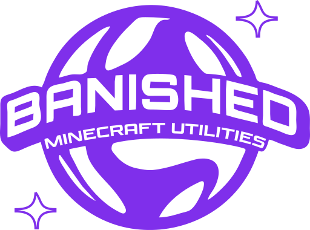

	</img>

<h1 align=center>Welcome To Banished</h1>

### What is Banished?

Banished is a Minecraft: Bedrock Edition communit, we focus on making tools for users to enhance their experience.
We operate the free-to-use website https://banished.app, with it you can port packs to iOS, make multipersona packs, replace official capes, and more.

This GitHub organization is used to store the source code of our projects, as much as we would like to be open-source, we cannot allow for people to create clones of our site and apps that are malicious, we do not want to take the risk of our users falling for these malicious sites.

### Our Community

You can join our Discord server at https://discord.gg/hGpRqPW32H. In our Discord you can chat with other people in the Bedrock Edition community, share packs, skins, capes, and more.
We are happy to add your packs to a channel in our server if requested, just make sure you are only using skins, and capes that you own.

### Support Us

If you are a user of our tools, and would like to show your support, you can by donating to us at https://buymeacoffee.com/xtremedev.
Any amount will help, server costs are something we need to pay for, and even $1 would help us get closer to covering what we pay.
